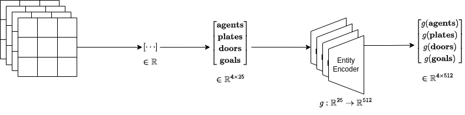

# rl-2023-final-project
Final Project for Reinforcement Learning 2023/2024 at Sapienza University. Our
goal is to reproduce the paper [Evolutionary Population Curriculum for Scaling
Multi-Agent Reinforcement Learning](https://arxiv.org/abs/2003.10423), but
change it to apply to discrete instead of continuous spaces. The authors have
provided an [implementation](https://github.com/qian18long/epciclr2020) of the
method that we can use for inspiration.

There is also [maddpg](https://github.com/openai/maddpg) repo from OpenAI that we
could utilise.

# Environment
We will use the [PressurePlate](https://github.com/uoe-agents/pressureplate)
environment. We can directly install this environment from its github repo:

```
pip install git+git@github.com:uoe-agents/pressureplate.git
```

The environment can be set up like a gym environment, it is important to **import** the `pressureplate` module
at the top so that it can be loaded by the `gym` package.

```python
import gym
import pressureplate

env = gym.make('pressureplate-linear-4p-v0')
env.reset()
```

## Action Space
The action space is discrete with 5 actions:

* 0: up
* 1: down
* 2: left
* 3: right
* 4: do nothing

You need to pass an action for **each** agent to the environment, e.g. for 4 agents:

```python
observations, rewards, dones, _ = env.step([0, 0, 0, 0])
```

The `step()` function returns the following:

* the observations of all agents as a nested list, e.g. for 4 agents a list with 4 lists.
* the floating point rewards of all agents as a list
* whether the agents have reached the goal, as a list of booleans
* an empty dictionary (who knows why)

## Observation Space
Each agent only sees the subset of the entire environment that is around them as layered 2D grids. It can be controlled with the `sensor_range`
attribute of the `PressurePlate` class. The default value is **4** and so the agent sees 4 steps in each direction,
creating a 5x5 grid around themselves, since distances are measured with the Manhattan distance. 

The 4 grids that each agent can see are the:

* **agent grid**: 1s where there are other agents, 0s where there are no other agents.
* **plates grid**: 1s where there are pressure plates, 0s where there are no plates.
* **doors grid**: 1s where there are doors, 0s where there are no doors.
* **goal grid**: 1s where the goal is, 0s where the goal is not.

The 4 grids are **flattened** from 5x5 into 1x25 and then **concatenated** into 1x100. Finally, the agent's x,y 
coordinates are concatenated at the end, giving us an observation of size 1x102.

```python
# agent is at coordinates 5,13
[0, 0, 0, 0, 0, 0, 1, 1, 0, 0,...,5, 13] 
```

## Reward
The reward is individual for each agent and is the Manhattan distance to that agent's pressure plate.


# Model

