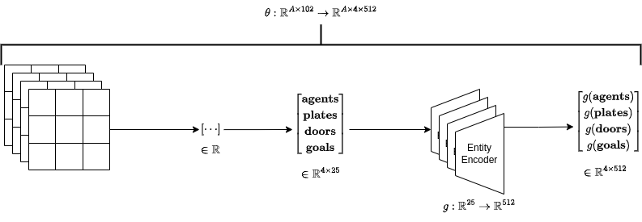

# rl-2023-final-project
Final Project for Reinforcement Learning 2023/2024 at Sapienza University. Our
goal is to reproduce the paper [Evolutionary Population Curriculum for Scaling
Multi-Agent Reinforcement Learning](https://arxiv.org/abs/2003.10423), but
change it to apply to discrete instead of continuous spaces. The authors have
provided an [implementation](https://github.com/qian18long/epciclr2020) of the
method that we can use for inspiration.

There is also [maddpg](https://github.com/openai/maddpg) repo from OpenAI that we
could utilise.

# Environment
We will use the [PressurePlate](https://github.com/uoe-agents/pressureplate)
environment. We can directly install this environment from its github repo:

```
pip install git+git@github.com:uoe-agents/pressureplate.git
```

The environment can be set up like a gym environment, it is important to **import** the `pressureplate` module
at the top so that it can be loaded by the `gym` package.

```python
import gym
import pressureplate

env = gym.make('pressureplate-linear-4p-v0')
env.reset()
```

## Action Space
The action space is discrete with 5 actions:

* 0: up
* 1: down
* 2: left
* 3: right
* 4: do nothing

You need to pass an action for **each** agent to the environment, e.g. for 4 agents:

```python
observations, rewards, dones, _ = env.step([0, 0, 0, 0])
```

The `step()` function returns the following:

* the observations of all agents as a nested list, e.g. for 4 agents a list with 4 lists.
* the floating point rewards of all agents as a list
* whether the agents have reached the goal, as a list of booleans
* an empty dictionary (who knows why)

## Observation Space
Each agent only sees the subset of the entire environment that is around them as layered 2D grids. It can be controlled with the `sensor_range`
attribute of the `PressurePlate` class. The default value is **4** and so the agent sees 4 steps in each direction,
creating a 5x5 grid around themselves, since distances are measured with the Manhattan distance. 

The 4 grids that each agent can see are the:

* **agent grid**: 1s where there are other agents, 0s where there are no other agents.
* **plates grid**: 1s where there are pressure plates, 0s where there are no plates.
* **doors grid**: 1s where there are doors, 0s where there are no doors.
* **goal grid**: 1s where the goal is, 0s where the goal is not.

The 4 grids are **flattened** from 5x5 into 1x25 and then **concatenated** into 1x100. Finally, the agent's x,y 
coordinates are concatenated at the end, giving us an observation of size 1x102.

```python
# agent is at coordinates 5,13
[0, 0, 0, 0, 0, 0, 1, 1, 0, 0,...,5, 13] 
```

## Reward
The reward is individual for each agent and is the Manhattan distance to that agent's pressure plate.


# Model
We adopt the decentralized execution framework, so each agent has its own Q function and policy
network. 

## Observation Encoder
The observation encoder $\theta$ encodes the different entities inside the environment into a higher dimension. The four entities that
agents can see are:

- agents
- plates
- doors
- goal

Each of these is embedded from $\mathbb{R}^{25}$ to $\mathbb{R}^{512}$ by a two-layer neural network (Entity Encoder), denoted as $g$ in
the diagram below. The environment observations consist of entity grids that are flattened by the game and returned as 
observations into a vector in $\mathbb{R}$. We then unfold this vector into a matrix where each row is an entity. Finally,
we apply a dedicated entity encoder to each entity and stack the results into a matrix of shape $\mathbb{R}^{4 \times 512}$.



## Observation Action Encoder
The Observation Action encoder $f$ receives an observation from the environment and first uses the Observation Encoder to
embed it in a higher dimension. The observation is global in the sense that it is what the pressureplate environment 
returns and it contains the information about all agents in the game. Each agent has their **own** Observation Action 
Encoder which they use to weigh the observations of the other agents that are close to them, and embedding the weighted
observations as well as the encoded action into the embedding dimension.

## Attention Embedding
Attention is an integral part of the Observation Encoder as well as of the Q function. It is used to calculate weights
$\alpha$ that are used to weigh the observations of the other visible agents along the entity dimension. This means that
the attention scores are calculated by pairwise inner product between the agent owning the Observation Action Encoder/Q 
function and the other visible agents, for each entity separately. I.e. for the Observation Action Encoder of agent A,
we calculate the attention as the inner product between the plates of agent A and agent B, the doors of agent A and 
agent B etc. Essentially what we are doing is finding which parts of what the other agents are seeing is important to 
the agents.

## MADDPG
For the training of multiple agents the MADDPG has been implemented.
It can be summarized as follow:


To run the training, execute:

```shell
python main.py
```

The training algorithm logs to **tensorboard**, to start the tensorboard server:

```shell
tensorboard --logdir=runs
```
